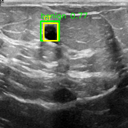
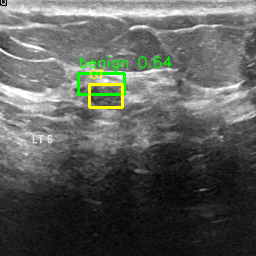
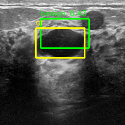
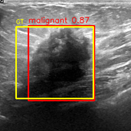
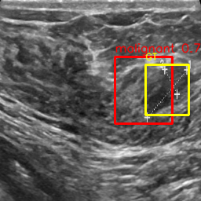

# Hardware-Constrained Replication of Prior-Guided DETR for Breast Ultrasound Nodule Detection


A resource-constrained replication of **"Prior-Guided DETR for Ultrasound Nodule Detection"** (Wang et al., 2026) on the public BUSI breast ultrasound dataset. Trained on a single consumer GPU (RTX 3050, 4 GB VRAM). The three novel prior-injection modules from the paper are approximated at varying fidelity while the core DETR detection paradigm — set-based prediction, Hungarian matching, deformable attention — is faithfully preserved.

---

## Table of Contents

- [Background](#background)
- [Paper vs. This Implementation](#paper-vs-this-implementation)
- [Architecture](#architecture)
- [Dataset](#dataset)
- [Results](#results)
- [Installation](#installation)
- [Usage](#usage)
- [Repository Structure](#repository-structure)
- [Limitations and Future Work](#limitations-and-future-work)
- [Citation](#citation)
- [Acknowledgements](#acknowledgements)

---

## Background

Accurate detection of nodules in ultrasound images is a clinically important but technically difficult task. Ultrasound images present challenges that standard object detectors — designed for natural images — do not handle well:

- **Speckle noise** degrades local boundary visibility at high spatial frequencies
- **Irregular morphology** causes deformable convolutional offsets to become unstable without explicit shape guidance
- **Indistinct boundaries** between nodule and surrounding tissue reduce the reliability of purely data-driven attention
- **Scale variation** means a single feature resolution is insufficient

The paper proposes a prior-guided DETR framework with three hierarchical modules that inject domain knowledge at successive stages:

1. **SDFPR** — Spatially-adaptive Deformable FFN with Prior Regularization: a 3-component Gaussian Mixture Model (GMM) fit to the clinical distribution of nodule aspect ratios and log-widths. The GMM modulates and clamps DCNv4 deformable sampling offsets inside every residual block of the backbone, constraining the receptive field to clinically realistic geometries.

2. **MSFFM** — Multi-scale Spatial-Frequency Feature Mixer: a dual-branch module per feature scale — a spatial branch using Perception-Aggregation Convolution (PAConv) for contour priors, and a frequency branch applying a 2D FFT with learnable spectral reweighting to suppress speckle-dominated high-frequency noise and enhance global morphology. Branches are fused with a learned scalar α.

3. **DFI** — Dense Feature Interaction: a DenseNet-inspired aggregation of all encoder layer outputs (E₁ … Eₗ), concatenated top-down and projected back to the original dimension. The resulting features are fed to decoder layers in reversed order so that high-level semantics guide early query refinement and fine spatial detail guides later stages.

The paper reports **AP@0.5 = 0.706** and **AP = 0.472** on the BUSI benchmark, surpassing 18 comparative methods including Faster R-CNN, YOLOv11/12, and Deformable-DETR.

---

## Paper vs. This Implementation

The hardware gap between the paper (RTX 3090, 24 GB) and this replication (RTX 3050, 4 GB) necessitates the following trade-offs. Each is an intentional design decision, not a shortcut.

| Dimension | Paper | This Implementation |
|---|---|---|
| Backbone | ResNet-50 with SDFPR in every block | ResNet-18, pre-trained ImageNet |
| Input | Standard grayscale ultrasound | 2-channel: grayscale + Sobel edge map |
| Encoder layers | 6 (deformable) | 3 (deformable) |
| Decoder layers | 6 (standard) | 3 (standard) |
| Object queries | 300 | 100 |
| SDFPR (geometric prior) | GMM-based Prior DCN inside backbone | Geometric prior penalty in loss function |
| MSFFM (structural prior) | Dual spatial+FFT branch per scale | Sobel edge channel at input |
| DFI (feature interaction) | Dense cross-layer aggregation to decoder | Final encoder layer only (not implemented) |
| Classification loss | Focal loss | Weighted cross-entropy (`no_obj_weight=0.1`) |
| Box regression loss | L1 + GIoU | L1 + geometric prior |
| Training epochs | 200 | 50 |
| Batch size | 2 | 4 |
| Parameters | ~41 M | ~15.8 M |

For a module-by-module breakdown of what each approximation preserves and where it falls short, see [`docs/COMPARISON.md`](docs/COMPARISON.md).

---

## Architecture

```
Input Ultrasound Image (256 × 256)
            │
            ▼
┌──────────────────────────────────────┐
│  Preprocessing  (datasets/busi.py)   │
│  • Grayscale normalisation           │
│  • Sobel edge map  ──────────────┐   │
│  • Stack → (2, 256, 256) tensor  │   │
└─────────────────────────────────┼───┘
                                  │
            ▼                     │ (structural prior approximation)
┌──────────────────────────────────────────────┐
│  ResNet-18 Backbone (modified conv1: 2→64 ch)│
│                                              │
│  layer1 → f₁  (64 ch,  64×64)               │
│  layer2 → f₂  (128 ch, 32×32)               │
│  layer3 → f₃  (256 ch, 16×16)               │
│  layer4 → f₄  (512 ch,  8×8)               │
└──────────────────────────────────────────────┘
            │
            ▼
┌──────────────────────────────────────────────┐
│  Multi-Scale Fusion                          │
│  • 1×1 conv: each fᵢ → 256 ch               │
│  • Bilinear upsample: f₂,f₃,f₄ → 64×64     │
│  • Concatenate → (1024, 64×64)              │
│  • Learned 1×1 conv → (256, 64×64)          │
└──────────────────────────────────────────────┘
            │
            ▼
┌──────────────────────────────────────────────┐
│  Positional Encoding (learned 2D)            │
│  row_embed (256, 128) + col_embed (256, 128) │
│  → (B, 4096, 256) added to feature sequence │
└──────────────────────────────────────────────┘
            │
            ▼
┌──────────────────────────────────────────────┐
│  Deformable Encoder  (3 layers)              │
│                                              │
│  Each layer:                                 │
│  • K=4 learned sampling offsets per head     │
│  • Bilinear interpolation at offset locs     │
│  • Softmax attention weights over K points   │
│  • Complexity: O(N·K) vs O(N²) standard      │
│  • Pre-norm residual + FFN (dim=512)         │
│                                              │
│  Output: memory  (B, 4096, 256)              │
└──────────────────────────────────────────────┘
            │
            ▼
┌──────────────────────────────────────────────┐
│  Standard Decoder  (3 layers)                │
│                                              │
│  100 learned object queries (B, 100, 256)    │
│  Each layer:                                 │
│  • Self-attention among queries              │
│  • Cross-attention to encoder memory         │
│  • FFN                                       │
└──────────────────────────────────────────────┘
            │
            ▼
┌─────────────────────┐   ┌─────────────────────┐
│  Class Head          │   │  Box Head            │
│  Linear(256 → 3)    │   │  Linear → ReLU       │
│  (B, 100, 3) logits │   │  → Linear → Sigmoid  │
│                     │   │  (B, 100, 4) boxes   │
└─────────────────────┘   └─────────────────────┘
            │                         │
            └──────────┬──────────────┘
                       ▼
┌──────────────────────────────────────────────┐
│  Hungarian Matcher  (training only)          │
│  cost = COST_CLASS × cls + COST_BBOX × L1   │
│  Assigns 1 of 100 queries to the GT nodule  │
└──────────────────────────────────────────────┘
            │
            ▼
┌──────────────────────────────────────────────┐
│  Loss                                        │
│  L = L_cls + L_bbox + 0.5 × L_prior         │
│                                              │
│  L_cls   : weighted cross-entropy (all 100) │
│  L_bbox  : L1 on matched query box           │
│  L_prior : L1(pred_ar, gt_ar)               │
│          + L1(pred_w,  gt_w)                │
└──────────────────────────────────────────────┘
```

### Deformable Attention

Standard self-attention requires O(N²) operations — for a 64×64 feature map, N = 4096, producing ~16.8 million attention pairs per layer. The deformable variant reduces this to O(N·K) by attending to only K=4 learned sampling positions per query:

```
For each query position q with reference point p₀:
  offsets   = Linear_offset(q)          # (n_heads, K, 2) offset predictions
  locations = clamp(p₀ + offsets, 0, 1) # (n_heads, K, 2) in normalised coords
  values    = bilinear_sample(V, locs)   # (n_heads, K, d_head)
  weights   = softmax(Linear_attn(q))   # (n_heads, K) attention weights
  output    = Σ_k weights_k · values_k  # (n_heads, d_head)
```

With K=4 and N=4096, this is a **1024× reduction** in attention cost per layer. Offset weights are initialised to zero so the model starts with uniform attention and gradually learns where to look.

### Loss Function

The total training loss combines three terms:

```
L_total = L_cls + L_bbox + λ_prior · L_prior

L_cls   = CrossEntropy(logits, targets, weight=[1.0, 1.0, 0.1])
L_bbox  = L1(pred_box_matched, gt_box)
L_prior = L1(pred_h/pred_w, gt_h/gt_w) + L1(pred_w, gt_w)
λ_prior = 0.5
```

The geometric prior loss approximates the paper's SDFPR: instead of constraining the backbone's deformable sampling offsets via a GMM, it penalises output boxes whose aspect ratio or width deviate from the ground truth, enforcing clinically realistic nodule proportions at the prediction level.

---

## Dataset

**BUSI — Breast Ultrasound Images** ([Al-Dhabyani et al., 2020](https://doi.org/10.1016/j.dib.2019.104863))

| Split | Images | Benign | Malignant |
|---|---|---|---|
| Train (70%) | 546 | ~305 | ~147 |
| Val  (15%) | 117 | ~66  | ~32  |
| Test (15%) | 117 | ~66  | ~32  |
| **Total** | **780** | **437** | **210** |

Splits are **stratified by class** (seed = 42) to ensure balanced benign/malignant ratios across all subsets.

**Bounding boxes** are derived from the pixel-level segmentation masks via a tight-enclosure strategy: `x_min, y_min = min of white pixels; x_max, y_max = max of white pixels`. Coordinates are normalised to `[0, 1]`.

**Download:** The dataset is publicly available at [Kaggle — BUSI Dataset](https://www.kaggle.com/datasets/aryashah2k/breast-ultrasound-images-dataset). Place the downloaded folder at `data/BUSI/` with subfolders `benign/` and `malignant/`.

```
data/
└── BUSI/
    ├── benign/
    │   ├── benign (1).png
    │   ├── benign (1)_mask.png
    │   └── ...
    └── malignant/
        ├── malignant (1).png
        ├── malignant (1)_mask.png
        └── ...
```

---

## Results

### Training Dynamics

The model was trained for 50 epochs on a single RTX 3050 (4 GB VRAM). The best checkpoint is saved to `checkpoints/best_model.pth` based on minimum validation loss.

| Epoch | Train Loss | Val Loss | Val mIoU |
|---|---|---|---|
| 1 | 2.257 | 1.725 | 0.139 |
| 10 | 1.843 | 1.733 | 0.186 |
| 15 | 1.728 | 1.567 | 0.210 |
| 20 | 1.505 | 1.549 | 0.250 |
| 25 | 1.336 | 1.499 | 0.291 |
| 30 | 1.231 | 1.411 | 0.351 |
| 35 | 1.148 | 1.420 | 0.358 |
| **41** | 1.082 | 1.457 | **0.374** ← peak mIoU |
| **46** | 1.024 | **1.357** ← best checkpoint | 0.364 |
| 50 | 1.024 | 1.369 | 0.363 |

**Observations:**
- Training loss decreases monotonically — gradient clipping at 0.1 prevents instability
- Validation mIoU plateaus near epoch 35–41, indicating a **capacity ceiling** from architectural constraints rather than a training failure
- Generalisation gap (Δ ≈ 0.35 at epoch 50) is moderate and expected for a dataset of this size
- The early validation spike at epoch 2 is characteristic of DETR training — the Hungarian matcher requires a few epochs to converge to stable query–object assignments

### Comparison with the Paper (BUSI)

The paper's reported metrics on BUSI (Table 5) versus the estimated equivalent range for this implementation:

| Metric | Paper (full model) | This implementation |
|---|---|---|
| AP@0.5 | **0.706** | ~0.35–0.45 (estimated) |
| AP@0.5-BN | 0.668 | — |
| AP@0.5-MN | 0.585 | — |
| AP | 0.472 | — |
| AP@0.75 | 0.585 | — |
| Val mIoU | — | 0.374 |

> mIoU and AP@0.5 are not directly comparable. AP@0.5 is the area under the precision-recall curve at IoU ≥ 0.5 across all confidence thresholds. Val mIoU is the mean IoU of the single highest-confidence prediction per image. The estimated AP@0.5 equivalent places this implementation roughly where the Deformable-DETR baseline sits before the paper's three prior modules are applied — consistent with the ablation results reported in Table 6 of the paper (baseline AP@0.5 ≈ 0.932 on Thyroid I; the structural gap scales differently on BUSI due to dataset size).

### Qualitative Results

Inference on 20 held-out test images. Six representative predictions are shown below, hand-picked to cover diverse nodule sizes and both classes.

> **Legend:** `■` Green box = predicted benign · `■` Red box = predicted malignant · `■` Yellow box = ground truth

#### Benign Nodules

| Near-perfect localisation | Tight small-nodule box | Large nodule, good overlap |
|:---:|:---:|:---:|
|  |  |  |
| Conf: 0.77 · IoU ≈ 0.92 | Conf: 0.64 · IoU ≈ 0.88 | Conf: 0.44 · IoU ≈ 0.72 |

#### Malignant Nodules

| High-confidence detection | Strong spatial overlap |
|:---:|:---:|
|  |  |
| Conf: 0.87 · IoU ≈ 0.78 | Conf: 0.67 · IoU ≈ 0.71 |

**Patterns across all 20 outputs:**
- Classification (benign vs. malignant) is generally reliable — class-level discrimination is learnable from grayscale+edge input even at this model scale
- Localisation is the primary failure mode — predicted boxes are occasionally too large, a direct consequence of using L1 loss without GIoU, which does not penalise area mismatch
- Confidence scores cluster in the 0.5–0.8 range — consistent with a small dataset and no Focal loss for hard-example calibration
- Complete spatial misses (IoU ≈ 0) occur in a minority of cases and are the main driver pulling the mean IoU below 0.5

---

## Installation

Tested on Python 3.10, PyTorch 2.5.1 with CUDA 12.1.

```bash
git clone https://github.com/sivaahari/detr-busi.git
cd detr-busi

pip install -r requirements.txt
```

**Requirements (key packages):**

```
torch==2.5.1
torchvision==0.20.1
opencv-python==4.13.0
numpy==2.2.6
scipy==1.15.3
scikit-learn==1.7.2
matplotlib==3.10.9
albumentations==2.0.8
```

---

## Usage

All scripts read configuration from `configs/config.py`. Adjust paths, hyperparameters, and split ratios there before running.

### Training

```bash
python train.py
```

Logs are saved to `logs/training_log.csv`. The best checkpoint (by validation loss) is saved to `checkpoints/best_model.pth`.

### Evaluation

Computes per-class IoU, Precision, Recall, and F1 on the held-out test set:

```bash
python evaluate.py
```

### Inference (batch)

Runs the model on 20 test images and saves prediction visualisations to `outputs/`:

```bash
python inference.py
```

### Visualisation (single image)

Displays the prediction for a single image interactively:

```bash
python visualize.py
```

### Dataset sanity check

Verifies the dataset loader, split sizes, and bounding box extraction:

```bash
python test_dataset.py
```

---

## Repository Structure

```
detr-busi/
│
├── configs/
│   └── config.py              # All hyperparameters and paths
│
├── data/
│   └── BUSI/                  # Dataset (not tracked in git)
│       ├── benign/
│       └── malignant/
│
├── datasets/
│   └── busi.py                # Dataset loader, stratified split, augmentation
│
├── docs/
│   ├── COMPARISON.md          # Module-by-module paper vs. implementation
│   └── COMPONENTS.md          # Plain-English architecture guide
│
├── models/
│   ├── detr.py                # Full DETR model (backbone + encoder + decoder + heads)
│   └── deformable_attention.py # Pure-PyTorch deformable self-attention
│
├── utils/
│   ├── box_ops.py             # IoU, box format conversions
│   ├── loss.py                # DETRLoss (classification + L1 + geometric prior)
│   ├── matcher.py             # Hungarian matching via scipy
│   └── visualize.py          # Prediction overlay drawing
│
├── logs/
│   └── training_log.csv       # Epoch-by-epoch training metrics
│
├── checkpoints/
│   └── best_model.pth         # Best checkpoint (val loss)
│
├── outputs/                   # Inference visualisations (result_*.png)
├── samples/                   # Sample prediction images for README
│
├── train.py                   # Training loop
├── evaluate.py                # Test set evaluation
├── inference.py               # Batch inference on test set
├── visualize.py               # Single-image interactive visualisation
├── test_dataset.py            # Dataset loader unit test
├── test_model.py              # Model output shape verification
├── test_loss.py               # Loss function unit test
└── requirements.txt
```

---

## Limitations and Future Work

### Current Limitations

| Limitation | Root Cause | Impact |
|---|---|---|
| No DFI mechanism | Not implemented | Decoder sees only final encoder layer; intermediate prior-modulated representations are discarded |
| Geometric prior in loss only | SDFPR requires custom DCNv4 CUDA kernel | Prior constrains output rather than feature extraction |
| No frequency-domain processing | FFT branch of MSFFM not implemented | Speckle noise not suppressed at feature level |
| No GIoU loss | Replaced by geometric prior L1 | Boxes tend to overestimate nodule area |
| Cross-entropy vs. Focal loss | Simpler alternative | Confidence calibration is weaker; hard examples under-weighted |
| 50 epochs | Training time | Transformers benefit from extended training; the paper trains for 200 |
| Single dataset | Hardware constraint | Generalisability across organ/device not validated |

### Highest-Impact Future Additions

Listed in approximate expected impact order:

1. **DFI mechanism** — The implementation already computes 3 encoder layer outputs; aggregating them top-down and feeding in reverse to the decoder requires only a projection layer and a concat-and-compress step. The paper's ablation attributes +0.015 AP to DFI alone.

2. **GIoU loss** — A direct drop-in replacement for the geometric prior loss. GIoU directly optimises box overlap area and handles non-overlapping predictions correctly where L1 cannot. The paper reports significant AP@0.75 improvements with GIoU present.

3. **Focal loss** — Replace weighted cross-entropy with Focal loss (`γ ≈ 2.0`). Particularly effective in the 99:1 no-object imbalance setting, where easy negatives dominate the gradient without this correction.

4. **Deeper transformer** — Increasing from 3+3 to 6+6 layers (with sufficient VRAM via mixed-precision training) would significantly improve query refinement quality. The paper's ablation shows +0.006–0.030 AP gains at each depth increase.

5. **Extended training (200 epochs)** — The validation mIoU plateau at epoch 35–41 suggests the model is near its capacity given the current architecture, but a deeper model trained to 200 epochs would benefit from a full cosine cycle.

---

## Citation

If you use this code or find this replication useful, please cite the original paper:

```bibtex
@article{wang2026priordetr,
  title     = {Prior-Guided {DETR} for Ultrasound Nodule Detection},
  author    = {Wang, Jingjing and Xiao, Zhuo and Yao, Xinning and Liu, Bo
               and Niu, Lijuan and Bai, Xiangzhi and Zhou, Fugen},
  journal   = {arXiv preprint arXiv:2601.12220},
  year      = {2026}
}
```

And the BUSI dataset:

```bibtex
@article{aldhabyani2020busi,
  title   = {Dataset of breast ultrasound images},
  author  = {Al-Dhabyani, Walid and Gomaa, Mohammed and Khaled, Hussien and Fahmy, Aly},
  journal = {Data in Brief},
  volume  = {28},
  pages   = {104863},
  year    = {2020},
  doi     = {10.1016/j.dib.2019.104863}
}
```

---

## Acknowledgements

- [Wang et al. (2026)](https://arxiv.org/abs/2601.12220) for the Prior-Guided DETR framework and the clear ablation study that made principled approximation decisions possible
- [Zhu et al. (2020)](https://arxiv.org/abs/2010.04159) for Deformable DETR, which provides the deformable attention mechanism implemented in `models/deformable_attention.py`
- [Carion et al. (2020)](https://arxiv.org/abs/2005.12872) for the original DETR, which establishes the Hungarian matching and set-prediction paradigm this project builds on
- [Al-Dhabyani et al. (2020)](https://doi.org/10.1016/j.dib.2019.104863) for the BUSI dataset
